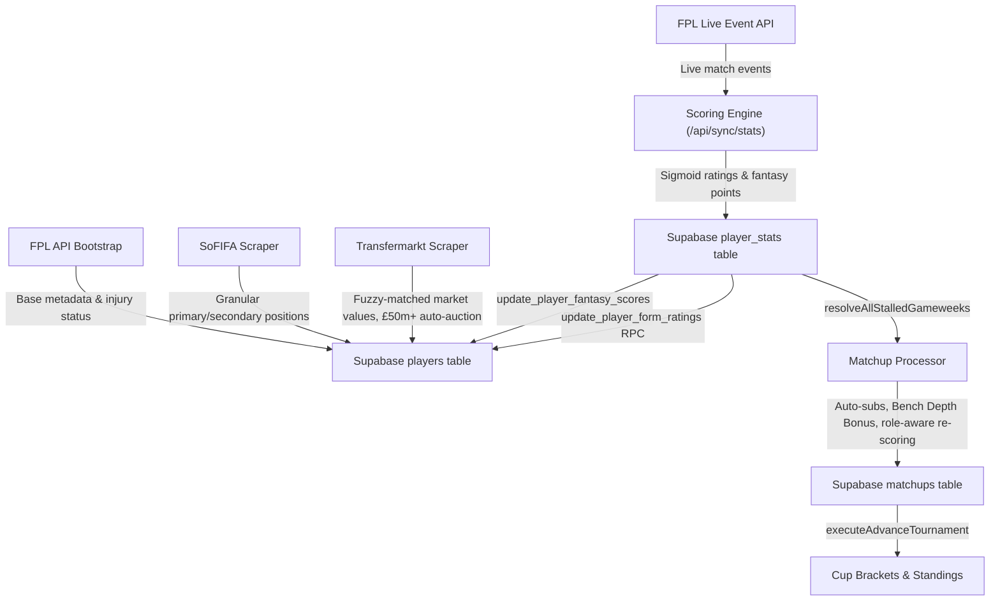

# Gaffa

Gaffa is a dynasty-style fantasy football (soccer) app built for a single private league, live at [gaffa.live](https://gaffa.live). It exists because mainstream fantasy platforms — FPL, Sleeper, ESPN — score football with a spreadsheet's idea of the sport: a flat points table, three generic position buckets, and a season that resets to zero every summer. Gaffa scores it like a match-rating site instead, and runs the league like a real football club's boardroom.

**The rule that shapes everything else:** a player is judged against what his specific role is expected to produce, not against a universal points table. There is no scoring quirk to farm — the way to win Gaffa is to be right about footballers.

The full player-facing rulebook — every mechanic paired with the reasoning behind it — lives in **[docs/USER_GUIDE.md](docs/USER_GUIDE.md)**. This document is the shorter version, plus the engineering underneath it.

---

## What sets Gaffa apart

| | **FPL** | **Sleeper (dynasty)** | **Gaffa** |
|---|---|---|---|
| Scoring | Flat points table, same for every player in a bucket | Flat points table, customizable but still context-free | Contextual sigmoid rating against **position-specific statistical baselines** — a clean sheet and a quiet 90 minutes are not scored the same way for a CB and a striker |
| Positions | 3–4 generic buckets (GK/DEF/MID/FWD) | Sport-generic slots, not football-tactical | **12 real tactical roles** (CB, LB, RB, LWB, RWB, DM, CM, AM, LW, RW, ST, GK) — a wing-back is not a centre-back |
| Season model | Redraft every year, or classic "keep a few players" | True dynasty rosters | True dynasty — **one draft, ever**; every player after that is bought, sold, loaned, or traded like a real transfer |
| Economy | None — free waivers | FAAB waivers, typically blind and capped | An **open, public auction economy**: visible bidding, uncapped permanent budget, transfer fees that partly recirculate to the rest of the league (Scout's Fee + solidarity) instead of just vanishing |
| Depth of squad-building | Starting XI only | Bench + taxi squad | Starting XI, bench with **strict positional cover**, Injured Reserve, an **Academy** for U21 prospects, a **loan market** with recall clauses and performance bonuses, and a **Retained List** for players who leave the league but might come back |
| Season shape | League table only | League table (+ optional playoffs) | League table **plus three parallel knockout cups** running simultaneously, so a mid-table club still has something to play for in March |
| Squad transactions | Waivers only | Waivers + trades | Waivers/auctions + **unrestricted manager-to-manager trades** + **loans** (with real transfer terms: fees, recall clauses, buyback pricing) |

Nothing here is decorative. Every one of these systems solves a specific failure mode of the games it's compared against — see [docs/USER_GUIDE.md](docs/USER_GUIDE.md) for the reasoning behind each (why cups exist, why the transfer fee partly recirculates, why loans are capped 1-out/2-in, why retention pays 60% and not more).

---

## Core Systems

### Position & formation taxonomy
Gaffa enforces **12 tactical positions** — no generic DEF/MID/FWD buckets, no LM/RM (auto-mapped to LW/RW). Eligibility is exact: a bench centre-back never covers a left-back slot, because "defender" isn't a real football job. Starting XIs must fit one of **12 supported formations** (`4-3-3`, `4-2-1-3`, `4-2-2-2`, `4-2-4`, `4-3-1-2`, `4-3-2-1`, `3-4-1-2`, `3-4-3`, `3-4-2-1`, `3-5-2`, `5-3-2`, `5-2-3`), sourced from `src/types/index.ts`. Benches split into DEF/MID/ATT/FLEX groups, where FLEX accepts any starter-eligible player, including an emergency goalkeeper.

Two independent lock timings, not one: a manager's **formation** locks at the first kickoff involving any of their squad, but an **individual player** only locks when his own club kicks off — so a Saturday-morning lineup can still react to lunchtime results before the late kickoffs.

### Scoring engine (sigmoid rating → points)
Instead of flat per-action points, every match performance is rated **1.0–10.0** against position-specific statistical baselines, then converted onto a separate, steeply convex fantasy-points scale.

1. **Sigmoid normalization** — raw FPL stats are compressed into a `0.0–1.0` component score per rating dimension via a logistic sigmoid against position-specific seasonal medians/stddevs:
   $$score = \frac{1}{1 + e^{-Z}}, \quad Z = K \cdot \frac{value - median}{stddev}, \quad K = 1.0$$
   Baselines are stored in `rating_reference_stats` and recomputed from live current-season data, so "average" is always relative to this season's actual Premier League, not a fixed historical constant.
2. **8 rating components**: `match_impact`, `influence`, `creativity`, `threat`, `defensive`, `goal_involvement`, `finishing`, `save_score`. Goals score 6, assists 4, on a global cross-position scale. Clean-sheet bonuses are weighted by role (GK 16, DEF/DM 12, CM 4, AM/ATT 0) and require ≥60 minutes played. Goals conceded penalize keepers directly and outfielders against their team's *expected* goals conceded, not the raw scoreline.
3. **Positional weighting + flex boost** — each of the 12 positions has its own weight profile across the 8 components; a player's single best role-relevant component that match gets an extra boost, so one standout facet of a performance isn't diluted by an average one elsewhere.
4. **Two decoupled scales**: the on-screen rating anchors an average starter at ≈6.5 (Fotmob-calibrated); fantasy points come from a separately-calibrated convex curve on the same composite — a 6.0 rating pays close to nothing (0.44 pts) while a 9.0 pays 36.6. **Anything at or under a ≈5.84 rating scores exactly zero.** Points floor at 0; they never go negative.
5. **Out-of-position penalty** — a midfielder or attacker fielded in a defensive slot takes a 20% penalty to both rating and points, closing the baseline-mismatch arbitrage where defensive volume flatters a player being measured against the wrong yardstick.

### Weekly matchups & cups
A team's weekly score is its starting XI's fantasy points, plus a **Bench Depth Bonus**: unused bench players who *did* play add 25% of their points to the total, so a deep squad is worth something beyond insurance. A **10-point draw band** absorbs noise that isn't a real result — smaller gaps are draws, not coin-flip wins.

Auto-subs replace a zero-minute starter once his own fixture is confirmed finished, scanning the bench in a fixed **DEF → MID → ATT → FLEX** order and re-rating the substitute against the *slot he filled*, not his own position.

Three knockout cups — **Champions Cup**, **League Cup**, **Consolation Cup** — run in parallel with the league table, seeded by league position, so a club with no title chance still has a tie to play for. Cups never draw: level scores are broken by best individual performer, then by bracket seed.

### The transfer market (open auction economy)
Every player not currently on your roster — genuine free agents and other managers' listings alike — sits on **one board**, bid on the same way: a public, uncapped-duration **open auction**, paid from a **Club Balance** (the product name for the internal `faab_budget` — permanent, uncapped, never resets between seasons, and itself a tradeable asset).

- Auctions have no fixed clock: a 72-hour initial window, a 24-hour floor after the first real bid, and a *decaying* inactivity timeout (12h → 4h → 2h → 1h as the auction ages) so a contested auction can never freeze on a snipeable public deadline. A quiet-hours guard (00:00–08:00 by default) means nothing resolves while managers are asleep.
- **20% of every winning bid recirculates**, split between the manager who opened that auction (**Scout's Fee**, 10% uncapped) and an equal **solidarity payment** to every other non-winning club — modeled on FIFA's real solidarity mechanism, so a bidding war between two clubs funds everyone else instead of just draining the league's money supply.
- Selling your own roster requires a minimum listing price of **80% of market value**, closing the trivial-transfer exploit two managers could otherwise use to move an asset for €1m.
- Dropping a player for space costs a **severance fee** (20% of market value, min €2m) — churn isn't free.

### Trades & loans
Manager-to-manager **trades** need no commissioner approval and have no deadline — any combination of players, Club Balance, and Retained List rights against any combination of theirs. A trade involving a player already live in a gameweek is deferred until that gameweek resolves, so a mid-week trade can't be used to escape a bad lineup.

**Loans** move a player to another club for 4–16 gameweeks against an upfront fee and an optional per-point performance bonus, with a recall clause or a flat buyback fee to reclaim the roster slot. Hard capped at **1 player out, 2 players in** at a time, so loans stay a specific deal about a specific player rather than a second roster.

### Dynasty format & departures
The league drafts **exactly once**, ever. After that every new player is bought at auction. Rosters carry Active/Bench, **IR** (injured reserve — doesn't count against the roster cap, but blocks that manager from bidding while a healthy player sits on it), and an **Academy** for U21 prospects (age-cutoff, not games-played, so it can't be used to hide useful squad players off the books).

When a rostered player leaves the Premier League, the owning manager chooses, per departure: **Release** (60% of market value in compensation, and a bar from bidding on his eventual return) or **Retain** (forfeit the cash, keep tradeable rights that mature automatically if he ever comes back). The choice — and the exclusion that comes with Release — exists specifically to close an exploit the original all-cash-payout design had: a manager could be paid out *and* still win the player back later with a free option nobody else had. A player who leaves **on loan** skips the choice: he stays yours off the roster, uses no squad place or retained slot, and rejoins the squad automatically when he returns.

An arrival that finds the squad full (a loan ending, a retained player returning, an auction nobody with room bid on) is **held** rather than auto-dropped or pushed over the limit: he waits off the squad until the manager activates or drops him. While anyone is held the squad can't grow, and a hold that outlasts the next gameweek's first kickoff locks the lineup to the last one saved.

### The offseason reset
Once every fixture and cup tie is complete, the commissioner triggers the reset: rosters lock, the season is archived (standings, matchups, cup results, player stats), placement and cup prizes are paid (€40m→€20m by league position, €50m/€20m Champions Cup, €25m/€10m League and Consolation Cup), win/loss/draw records zero out, **Club Balance carries over untouched**, and a new schedule plus fresh cup brackets are generated. Departures are handled continuously through the season via Release/Retain, not dumped on the league in one lump at reset — so relegation arrives as a series of decisions across the summer, not a single event.

---

## Tech Stack

- **Frontend**: Next.js 16 App Router with React Server Components and React 19. Styling is strict, token-based CSS Modules — no utility-class framework — with two full themes (light "Cream Editorial", dark "Premium Dark") and a distinct design token per tactical position. Animation via Framer Motion.
- **Backend & database**: Supabase (PostgreSQL) for auth, relational data, and Row Level Security. Transactionally critical game logic — bid resolution, matchup scoring, trade execution — is implemented as **Postgres stored procedures/RPCs**, not just application code, so money and rosters move atomically. Sync and resolution timing is driven by Vercel Cron.
- **Data ingestion**: three external sources are fused into one player record — the **FPL API** (live stats, injury status, fixtures), a **SoFIFA scraper** (granular primary/secondary tactical positions the FPL API doesn't carry), and a **Transfermarkt scraper** (market values, fuzzy name-matched at a 0.72 similarity threshold, auto-triggering a system auction on any arrival worth ≥£50m).

---

## Project Structure

```text
src/
├── app/               # Next.js route groups — (auth), (dashboard), and api/ (sync, cron, admin, transfers)
├── components/        # UI components by domain (players, teams, transfers, layout, ui)
├── context/           # React context (theme)
├── lib/                # Core business logic:
│   ├── scoring/         #   sigmoid rating engine + matchup processor
│   ├── tournaments/      #   cup bracket generation and advancement
│   ├── offseason/        #   season reset, relegation compensation, prize distribution
│   ├── auction/, listings/  #   bidding economy, sale listings, loan terms
│   ├── roster/, lineups/   #   lineup validation and auto-subs
│   ├── economy/          #   solidarity payments, merit (match revenue) payouts
│   ├── clubs/             #   the durable club-identity registry (never keyed on FPL's seasonal team ids)
│   └── supabase/          #   client/server/admin Supabase clients
├── scripts/            # Data-sync and scraper scripts colocated with app code
└── types/              # Authoritative global types — Formation, position taxonomy, bench bonuses
supabase/migrations/   # Sequential numbered SQL migrations — the source of truth for schema
docs/USER_GUIDE.md     # The full player-facing rulebook this README summarizes
```

---

## Data Pipeline



1. **Player sync** (`/api/sync/players`) — pulls Premier League player metadata from FPL: names, clubs, injury status, preserving manual overrides.
2. **Tactical mapping** (`/api/sync/sofifa-players`) — matches players to their EA FC squad entries and updates primary/secondary tactical positions.
3. **Market valuation** — the Transfermarkt scraper fuzzy-matches names (0.72 similarity threshold), updates market values, and seeds a system auction on any new arrival ≥£50m or any player at a newly-promoted club.
4. **Live ingestion** (`/api/sync/stats?mode=fpl_live`) — during live gameweeks, fetches FPL live events, runs them through the scoring engine, and writes ratings and points to `player_stats`.
5. **Gameweek resolution** — once FPL marks a gameweek finished, the matchup processor resolves head-to-head scores, applies auto-subs and role-aware re-scoring, and advances the cup brackets.
